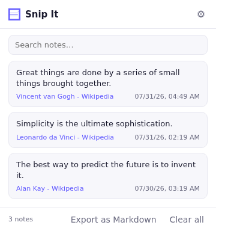
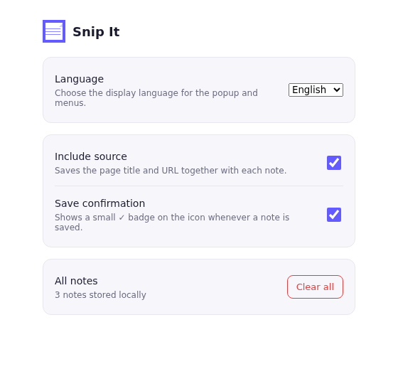
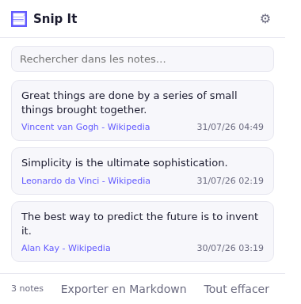

# Snip It — Note Manager

A Chrome extension (Manifest V3) that lets you select text on any web page,
save it with a right-click, then find, search and export your notes later.

<p align="center">
  
  
</p>

## Features

- **Quick capture**: select text → right-click → *"Save as note"*.
- **Popup**: list of notes with date, source (page title + link back to it),
  instant search, copy to clipboard, delete.
- **Markdown export**: download all notes as a single `.md` file.
- **Multi-language UI**: English by default, with a language switcher
  (English / Français) in the options page — independent from the browser's
  own language.

  
- **Options**:
  - Include or exclude the source title/URL in each note.
  - Toggle a visual confirmation badge on save.
  - Clear all stored notes.
- **100% local**: notes are stored with `chrome.storage.local`, nothing is
  sent to any external server.

## Tech stack

- Manifest V3 (service worker, no persistent background page)
- Vanilla JavaScript, no framework or dependency
- `chrome.contextMenus`, `chrome.storage`, `chrome.downloads`
- Lightweight custom i18n layer (`i18n.js`) plus native `_locales` for the
  Chrome Web Store listing (name/description)

## Local install (developer mode)

1. Open `chrome://extensions` in Chrome.
2. Enable **Developer mode** (top right).
3. Click **Load unpacked**.
4. Select this project's folder.

## Project structure

```
manifest.json         # extension configuration
background.js         # service worker: context menu + note saving
i18n.js                # shared EN/FR message dictionary + helpers
popup.html/.js/.css   # popup UI (list, search, export)
options.html/.js/.css # settings page (incl. language switcher)
_locales/en, _locales/fr  # store-level localization (name, description)
icons/                # extension icons (16/32/48/128 px)
```

## Ideas for future improvements

- Sync notes across devices via `chrome.storage.sync`
- Tags / categories on notes
- Keyboard shortcut to open the popup directly
